+++
title = "Le champ des possibles est incommensurable."
date = 2023-04-20
tags = ["information", "intelligence", "pixel-art"]
+++

Cet article a pour but d'explorer le concept de champ des possibles (ou possibilités) et de mettre en évidence son incommensurabilité.

## Le champ des possibles ?

Le champ des possibles serait l'ensemble des structures possibles, généralement ou dans un context avec des contraintes spécifiques.

Ces structures peuvent être concrètes, comme des objets formés de matière, ou plus abstraites comme de l'information (e.g. un format numérique).

Par exemple, combien de configurations sont possibles pour un entier non signé 32-bits ? Chaque bit a deux états possibles, le nombre de possibilités est alors de `2^32`[^1], en l'occurrence une valeur de `0` à `4 294 967 295`. On pourrait représenter autre chose qu'un nombre, mais avec le même nombre de configurations.

[^1]: Les nombres de cet article sont notés dans une syntaxe similaire au [Lua](https://www.lua.org/manual/5.1/manual.html#2.1), i.e. `1e3` est équivalent à `10^3` et `10*10*10`.

Si on prend une information plus complexe, comme une image de 10x10 pixels où chaque pixel est soit noir ou blanc (un bit), il s'agit alors d'une séquence de `10*10*1` bits, 100 bits. Le nombre d'images possibles avec ces contraintes est déjà de `2^100`, environs `1e30`, ou mille milliards de milliards de milliards.

Un grand nombre, mais incommensurable ? Le nombres d'atomes dans l'univers est souvent utilisé pour comparer des nombres importants; à notre connaissance environs `1e80`. On peut argumenter que `1e30` n'est pas encore dans le domaine de l'incommensurable.

Pour une image plus usuelle, par exemple 1024x1024 pixels avec 8 bits par canal et 3 canaux (24 bits par pixel), il existerait `~2^(25 000 000)` possibilités (car `1024*1024*24` bits), soit `~10^(7 500 000)`[^2]. Le nombre d'atomes dans l'univers ne représente qu'une fraction de ce nombre; fraction tout aussi incommensurablement petite que ce dernier est incommensurablement grand (`~1e-7499918` %).

Parmi ces images, une infime partie a été perçue par l'humanité. Je suppose également qu'une infime partie aurait de l'intérêt pour la perception humaine, si on pense par exemple aux images constituées de pixels aléatoires. Mais même cette infime partie est probablement incommensurable.

[^2]: Pour faire une approximation de la conversion depuis le nombre en base 2 vers la base 10, la puissance est divisée par 10 puis multipliée par 3. E.g. `2^20` est approximativement `10^6`.

## La recherche dans le champ des possibles

### L'intelligence

On peut imaginer qu'il existe dans ces images des concepts, des plans, des idées, des formules ou autres données cruciales au développement de théories ou technologies. Ou encore des oeuvres artistiques incroyables.

Comment les trouver ? Comme l'information et ses possibilités me fascine, j'ai par le passé fait une expérience naïve avec un programme qui permet de naviguer en générant séquentiellement ou aléatoirement des images aux possibilités très restreintes. Même si parfois une image peut inspirer, par exemple par le phénomène de [paréidolie](https://fr.wikipedia.org/wiki/Par%C3%A9idolie), la plupart du temps il s'agira de bruit impertinent.

Récemment, l'avènement des modèles d'intelligence artificielle génératifs rend possible la production d'images sophistiquées à partir de plusieurs paramètres; particulièrement d'une description et d'une graine aléatoire. Dans le cas d'un modèle de diffusion, cette graine aléatoire définit l'information initiale qui va être progressivement transformée par l'inférence[^3] du modèle.

[^3]: Après la phase d'entrainement du modèle, c'est la phase d'exécution qui vise à exploiter ce dernier pour accomplir une tâche spécifique.

En utilisant d'autres graines on peut alors obtenir des images différentes qui correspondent à la même description. On peut voir ça comme une exploration du champ des possibles qui, comparé à mon expérience naïve, est bien plus efficace. 

Il existe cependant une autre façon plus traditionnelle d'obtenir une telle image: la créer soi-même. En cherchant à produire une image, nous faisons aussi une exploration dans le champ des possibles: par l'expérimentation, la sélection, la modification, la retouche; progressivement une image se forme.

Il semble en aller de même avec la programmation où l'exploration s'effectue dans le champ des code sources possibles, où une infime partie produira un programme correct.

Ma perception est que l'intelligence permet d'effectuer cette recherche; elle permet de converger vers des structures intéressantes d'une manière efficiente. Ce qui m'amène à ma définition actuelle, non exhaustive, de l'intelligence: **L'intelligence est le processus de recherche dans le champ des possibles de structures qui convergent vers un objectif.**

Je vois aussi dans le machine learning, via des algorithmes génétiques ou par le processus de *gradient descent* et de *backpropagation*, ce processus de recherche dans le champ des possibles d'une structure, ici un réseau de neurones, qui satisfait des contraintes et objectifs.

Je parlerais probablement ultérieurement de ma perception de l'intelligence et de son implémentation artificielle dans d'autres articles; pour ne pas rendre celui-ci interminable ou de mauvaise qualité.

### Le vivant

Je vois également le vivant comme une recherche dans le champ des possibles, défini comme (encore une fois de manière non exhaustive) **le processus de recherche dans le champ des possibles de structures qui persistent**. Par la reproduction, l'héritage, la mutation et la sélection, de nouvelles structures émergent progressivement, maximisant la persistance.

(Note: Dans le cas des algorithmes génétiques cette persistance est définie par les objectifs de la simulation. On pourrait imaginer un scénario où l'univers serait une simulation dont les conditions de persistance auraient pour but de résoudre un problème pour des entités supérieures.)

### L'art

Comme évoqué précédemment, je vois l'art comme une recherche dans le champ des possibles, dont les motivations sont variées (pour moi l'art est un domaine de l'intelligence).

Pour finir et donner un exemple de ce qui est exploré dans cet article, voici 100 images que j'ai réalisé en pixel art avec des contraintes extrêmes: 16x16 pixels, un bit par pixel.

Même avec ces contraintes, cela fait `~1e77` (car `2^256`) images possibles. Les 100 images qui suivent représentent donc `~1e-73` % de toutes les possibilités.

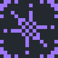

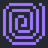
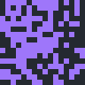
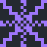

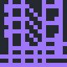

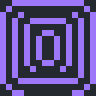

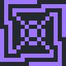

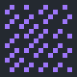

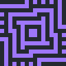

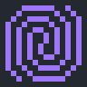

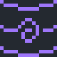

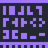

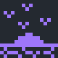

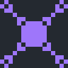

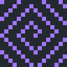
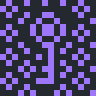

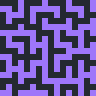

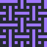

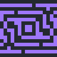
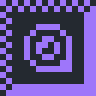

Combien de ces images possibles sont intéressantes ? J'aimerais bien voir ce que d'autres personnes créeraient avec ces mêmes contraintes (dans le seul objectif de produire 100 images).
